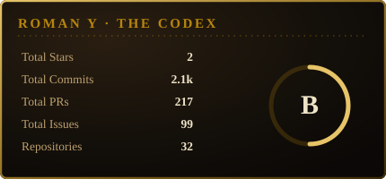
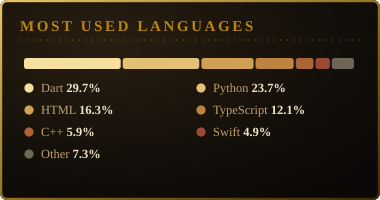
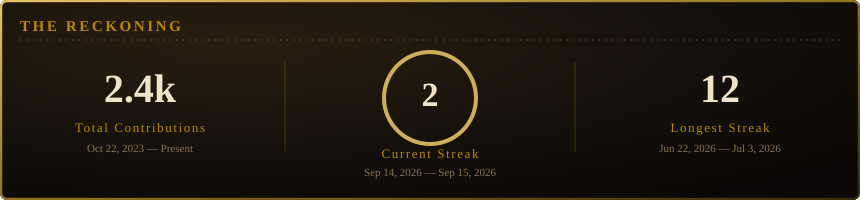
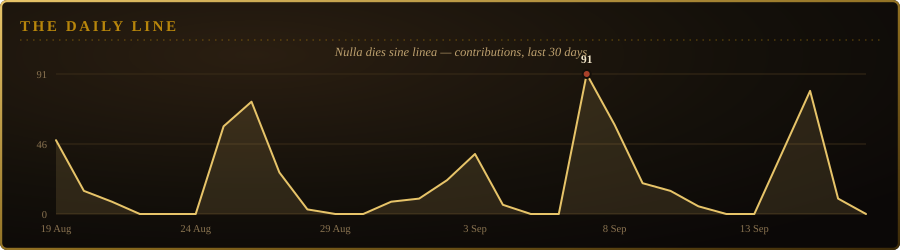
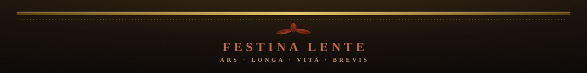

  

  

  
  
  

⚜ &nbsp;·&nbsp; ❧ &nbsp;·&nbsp; ✦ &nbsp;·&nbsp; ❧ &nbsp;·&nbsp; ⚜

## ❧ Ex Libris

> *Ostinato rigore* — **"stubborn rigor."**
>  — Leonardo da Vinci's personal maxim.

I'm a **Forward Deployed Engineer at Elcano**, working in the old Renaissance manner — part engineer, part craftsman — building agentic AI systems with stubborn rigor and a taste for elegant proportion.

I sit close to the problem. I translate messy requirements into clean architecture, useful automation, and software that ships, gets watched, and gets better with real feedback — engineering, product thinking, and applied AI worked on the same bench. Our agent **Victoria** does the dense work; I compose the systems around her.

⚜ &nbsp;·&nbsp; ❧ &nbsp;·&nbsp; ✦ &nbsp;·&nbsp; ❧ &nbsp;·&nbsp; ⚜

## ❦ The Commissions — *what I make*

- **❖**&nbsp; **Agentic workflows & LLM systems** — autonomous crews that take a task from intent to outcome, end to end.
- **❖**&nbsp; **Data pipelines & integrations** — the quiet plumbing that moves data reliably to where it's needed.
- **❖**&nbsp; **Production backend & tooling** — adtech products, operational instruments, growth-focused systems.
- **❖**&nbsp; **Rapid prototyping** — sketch, validate, harden, deploy — at studio speed.
- **❖**&nbsp; **Ambiguity → software** — turning fog and rumor into a reliable, finished work.

⚜ &nbsp;·&nbsp; ❧ &nbsp;·&nbsp; ✦ &nbsp;·&nbsp; ❧ &nbsp;·&nbsp; ⚜

## ✦ The Atelier — *instruments & pigments*

**Languages & Frameworks**

  
  
  
  
  
  
  
  
  

**Oracles — models consulted**

  
  
  
  

**AI & Automation**

  
  
  
  
  
  
  
  
  
  

**Platforms & APIs — programmatic AdTech**

  
  
  
  
  
  
  
  

**Design, Tools & Infrastructure**

  
  
  
  
  
  
  
  
  
  
  

⚜ &nbsp;·&nbsp; ❧ &nbsp;·&nbsp; ✦ &nbsp;·&nbsp; ❧ &nbsp;·&nbsp; ⚜

## ✺ Marginalia

  
<b>❧ &nbsp;Ostinato rigore</b>

   
  <i>"Stubborn rigor."</i> Leonardo da Vinci's personal motto — the conviction that mastery is won by relentless, patient discipline. It's how I like to build: not clever once, but right, and rigorous, and finished.

  
<b>❦ &nbsp;On the name "Elcano"</b>

   
  Juan Sebastián Elcano completed the first <b>circumnavigation of the globe</b> in 1522. Emperor Charles V granted him a coat of arms bearing a globe and the words <i>Primus circumdedisti me</i> — <i>"you were the first to encircle me."</i> We build in that spirit: <b>finish what others only begin.</b> Our agent <b>Victoria</b> takes her name from his ship.

  
<b>✦ &nbsp;Nulla dies sine linea</b>

   
  <i>"No day without a line."</i> The maxim of Apelles, the great painter of antiquity, who let no day pass without drawing at least one line — revived by the Renaissance as the creed of daily practice. Ship something every day; the work compounds.

⚜ &nbsp;·&nbsp; ❧ &nbsp;·&nbsp; ✦ &nbsp;·&nbsp; ❧ &nbsp;·&nbsp; ⚜

## ❖ The Codex — *by the numbers*

  
  

  

  

<i>Struck fresh each day from the GitHub API — see <code>scripts/render_cards.py</code>.</i>

⚜ &nbsp;·&nbsp; ❧ &nbsp;·&nbsp; ✦ &nbsp;·&nbsp; ❧ &nbsp;·&nbsp; ⚜

## ❧ Correspondence

If you're building with **AI, automation, data, or full-stack** — I'm always glad of a worthy commission.

  
  

  

